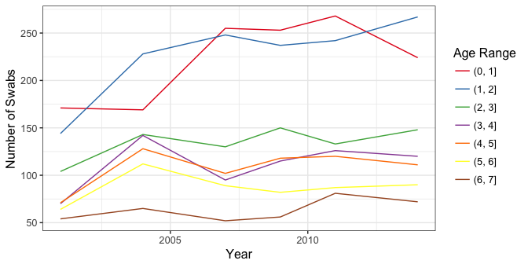
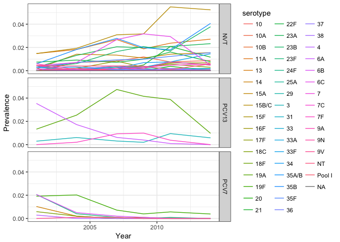
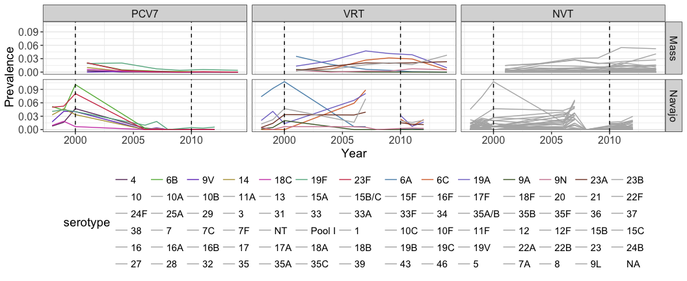
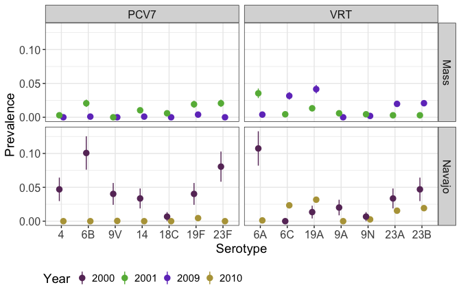
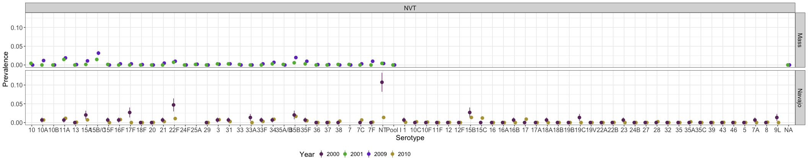

Exploratory Data Analysis
================
Lucy M Li
7/24/2017

Prevalence of *S. pneumoniae* carriers in the US after PCV7 introduction
------------------------------------------------------------------------

``` r
swab.data <- read.csv("../scripts/data/united-states/SPARC_SwabbingByAge_2001-2014 MDL.csv")
swab.data.N <- swab.data %>% group_by(year) %>% summarize(sum=sum(frequency))
pop.data <- read.csv("../scripts/data/united-states/united-states-pop-pyramid-2001.csv")
serotype.data <- read.csv("../scripts/data/united-states/SPARC2_CollectionYear_Serotypes_Age_2014_BMC.csv")
serotype.data$Serotype[serotype.data$Serotype==""] <- NA
serotype.data$Serotype <- factor(serotype.data$Serotype, exclude=NULL)
saveRDS(serotype.data, "../scripts/data/united-states/SPARC2-serotype-data.rds")
serotypes <- levels(serotype.data$Serotype)
data.years <- unique(swab.data$year)
age.groups <- levels(swab.data$age_range)
age.group.labels <- paste0("(", 0:6, ", ", 1:7, "]")
PCV7.serotypes <- c("4", "6B", "9V", "14", "18C", "19F", "23F")
# PCV13.added.serotypes <- c("1", "3", "5", "6A", "7F", "19A")
# PCV13.serotypes <- c(PCV7.serotypes, PCV13.added.serotypes)
VRT.serotypes <- c("6A", "6C", "19A", "9A", "9N", "23A", "23B")
total.vt.vrt.types <- length(c(PCV7.serotypes, VRT.serotypes))
total.types <- length(serotypes)
```

``` r
navajo.data <- read.csv("../scripts/data/united-states/NavajoDataTaj.csv")
navajo.summary <- navajo.data %>% 
  group_by(Year, serotype) %>%
  rename(year=Year) %>%
  summarise(total_count=n())
navajo.N <- data.frame(year=c(1998:2000, 2006, 2007, 2010:2012), 
                       N=c(270, 142, 5, 305, 767, 2649, 3268, 711))
navajo.N[1:3, 2] <- navajo.N[1:3, 2] + 
  navajo.summary %>% group_by(year) %>% summarize(positives=sum(total_count, na.rm=TRUE)) %>%
  filter(year <= 2000) %>% select(positives) %>% unlist
navajo.summary$prevalence <- navajo.summary$total_count / 
  navajo.N$N[match(navajo.summary$year, navajo.N$year)]
navajo.summary$dataset <- "Navajo"
navajo.summary$vaccine <- sapply(navajo.summary$serotype, function (x) {
  if (x %in% PCV7.serotypes) return ("PCV7")
  if (x %in% VRT.serotypes) return ("VRT")
  return ("NVT")
})
navajo.years <- unique(navajo.data$Year)
navajo.summary$N <- navajo.N$N[match(navajo.summary$year, navajo.N$year)]
navajo.summary %<>% 
  split(navajo.summary$serotype) %>%
  lapply(function (x) {
    if (length(navajo.years) == nrow(x)) return (x)
    data.frame(year=navajo.years[!(navajo.years %in% x$year)],
               serotype=x$serotype[1], total_count=0, prevalence=0.0,
               dataset="Navajo", vaccine=x$vaccine[1], N=x$N[1]) %>% rbind.data.frame(x)
  }) %>% 
  do.call(what=rbind.data.frame)
```

The total number of swabs increased between 2001 and 2014 for all age groups:

``` r
ggplot(swab.data) + theme_bw() +
  geom_line(aes(x=year, y=frequency, colour=age_range)) +
  scale_colour_brewer("Age Range", labels=age.group.labels, palette="Set1") +
  ylab("Number of Swabs") + xlab("Year") +
  theme(text=element_text(size=12))
```



Generate a list of data frames describing the number of swabs in each year for each of the 7 age groups as well as the total number of swabs.

``` r
swab.data.list <- split(swab.data[, -2], swab.data$age_range) %>% add.sum.data.frame
```

``` r
serotype.data.template <- data.frame(year=data.years, matrix(0, nrow=length(data.years), ncol=length(serotypes)))
names(serotype.data.template)[-1] <- serotypes
serotype.data.list <- split(serotype.data[, -4], serotype.data$Age_Years) %>%
  lapply(extract.freq.by.serotype, data.years, serotypes) %>%
  add.sum.data.frame
serotype.prev.list <- mapply(function (a,b) {
  b[, -1] <- sweep(b[, -1], 1, a$frequency, `/`)
  return (b)
}, swab.data.list, serotype.data.list, SIMPLIFY = FALSE)
```

The prevalence of serotypes targetted by the PCV7 vaccine declined after 2000. The prevalence of serotypes 7F and 19A increased in prevalence after PCV7 introduction, but declined after the introduction of PCV13 in 2010.

From 2001 to 2014, 30.3% of non-vaccine types (those not in PCV13) continuously decreased, 27.3% continuously increased, 33.3% increased after PCV7 introduction but decreased after PCV13 introduction, and 9.09% decreased after PCV7 introduction but increased after PCV13 introduction.

Overall, the prevalence of non-vaccine serotypes has increased by 226%.

``` r
serotype.prev.all.long <- 
  summarize.by.serotype(serotype.prev.list$all, PCV7.serotypes, VRT.serotypes) %>%
  data.frame(dataset="Mass")
names(serotype.prev.all.long)[names(serotype.prev.all.long)=="frequency"] <- "prevalence"
serotype.prev.all.long$N <- swab.data.N$sum[sapply(serotype.prev.all.long$year, match, swab.data.N$year)]

plot.serotypes.ts(serotype.prev.all.long, total.vt.vrt.types, data.years)
```



``` r
all.datasets.data <- rbind.data.frame(serotype.prev.all.long, navajo.summary[, names(serotype.prev.all.long)])
plot.serotypes.ts(all.datasets.data) + facet_grid(dataset~vaccine)
```



``` r
plot.serotypes.boxplot(all.datasets.data %>% 
                         filter(year%in%c(2000:2001, 2009:2010), vaccine!="NVT"), total.vt.vrt.types)
```



``` r
plot.serotypes.boxplot(all.datasets.data %>% 
                         filter(year%in%c(2000:2001, 2009:2010), vaccine=="NVT"), total.vt.vrt.types)
```



Correlations in prevalences
---------------------------

``` r
correlations <- serotype.prev.list$all %>%
  select(-c(year, NT, `Pool I`, `NA`)) %>% cor %>%
  reshape2::melt(value.name="Correlation", varnames=c("Serotype1", "Serotype2")) %>%
  filter(Serotype1!=Serotype2)
correlations <- correlations[order(abs(correlations$Correlation), decreasing=TRUE), ]
correlations <- correlations[seq(1, nrow(correlations), 2), ]
```

``` r
save.image("../scripts/data/united-states/data.RData")
```
